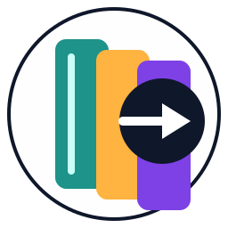

# Jelu Importer Browser Add-on

Jelu Importer is a Firefox browser extension that scrapes metadata from popular book catalog pages (Goodreads, Amazon
Books, etc.) and sends it to a self-hosted Jelu instance. The add-on focuses on giving users a fast, editable preview
before import so they can clean up titles, IDs, narrators, and other fields.

## Screenshots

Screenshots will be added once the UI is ready.

- **Popup / Import Flow:** _coming soon_
- **Configuration / Options Page:** _coming soon_

## Currently Supported Catalogs

- Goodreads
- Amazon Books
- Google Books (often has less complete book information)

## Installation from Releases

1. Download the latest `.xpi` package from the GitHub Releases page once builds are published.
2. In Firefox, open `about:addons`, select **Install Add-on From File...**, and choose the downloaded `.xpi`.
3. Verify that the add-on appears in the toolbar and pin it if necessary.
4. Open the extension options page to configure your Jelu server URL, port, and authentication details before importing
   any books.

## Configuration & Authentication

1. Open the add-on’s options page and enter your Jelu base URL (e.g. `https://jelu.example.com`).
2. Provide the username and password you normally use to sign into Jelu. The extension authenticates every request with
   HTTP Basic, so these credentials must have permission to add books. Credentials are stored in Firefox local storage
   without encryption, so create a dedicated, low-privilege Jelu account for this add-on if possible. Note if you use a
   different account than the one that you primarily use with Jelu then any of the "My Library" functions will not work.
3. Choose any default tags or toggle “add to library automatically” if you want the popup checkbox preselected.

The popup mirrors the default settings so you can override them for a specific book before importing.

## Documentation

- [Architecture & Feature Overview](docs/architecture.md)
- [Development & Automation Guide](docs/development.md)

Additional documents will be added under the `docs/` directory as the project evolves.
